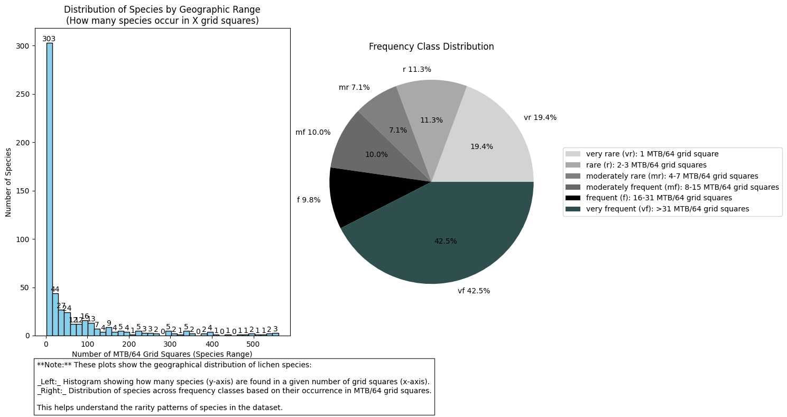
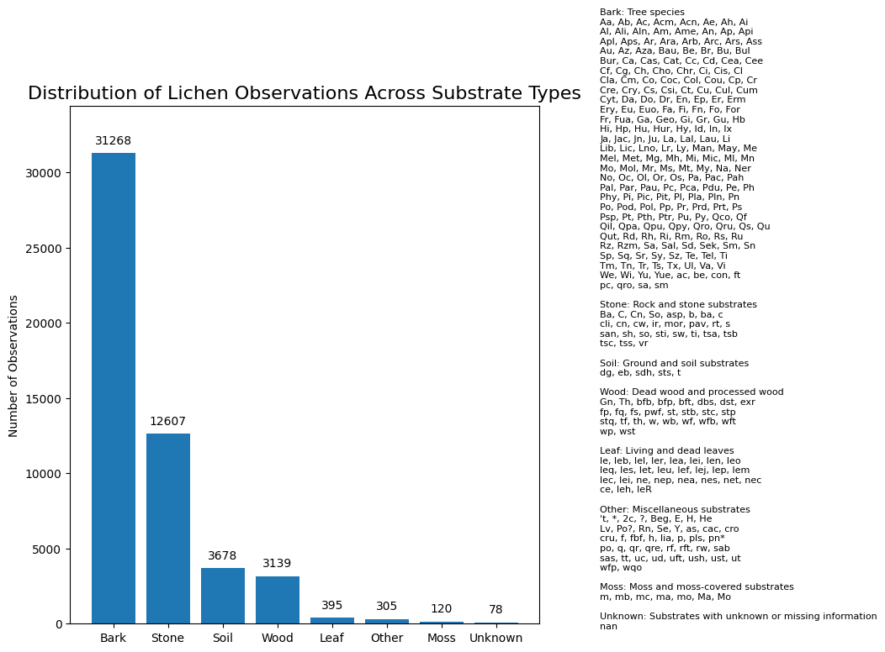

# Lichen Distribution Analysis in the Netherlands

## Overview

This project aims to analyze and visualize the distribution of lichens found in various locations across the Netherlands. The data includes information on the location, inventory codes, species categories, observation dates, substrate types, and the amount of lichen observed. The analysis will help in understanding the ecological distribution of lichens in the studied area.

## Data Description

The dataset consists of the following columns:

1. **Location**: Indicates where the lichen was found.
2. **KMHOK**: Refers to inventory locations, which can be used to create distribution maps of species.
3. **Genus**: The genus of the lichen.
4. **Species**: The specific species of the lichen.
5. **Date**: The date when the lichen was spotted.
6. **Substrate (Sub)**: Refers to the substrate on which the lichen grows, represented by abbreviations of trees, shrubs, stones, etc.
7. **Amount**: The number of lichen observed.

## Plotting Code

The code in `plotting.py` is designed to generate various plots based on the lichen data. The following plots will be created:

1. **Frequency Distribution Plot**: Shows the distribution of lichen species across different inventory locations.
2. **Substrate Distribution Plot**: Illustrates the number of observations across different substrate types.
3. **Species per Substrate Plot**: Displays the number of unique lichen species found on different substrates.
4. **Top Substrates Plot**: Highlights the top 25 substrates based on the number of observations.

### Example Plots

Here are some example plots generated from the analysis:

## Future Work

Further improvements and additional analyses will be added to this project, including:

- More detailed statistical analyses of the lichen data.
- Additional visualizations to explore relationships between species and environmental factors.
- Integration of more datasets for a comprehensive ecological study.

## Conclusion

This project serves as a foundational step in understanding the distribution of lichens in the Netherlands. The generated plots will provide valuable insights into the ecological patterns of these organisms, contributing to broader ecological research.

For any questions or contributions, please feel free to reach out!

---
